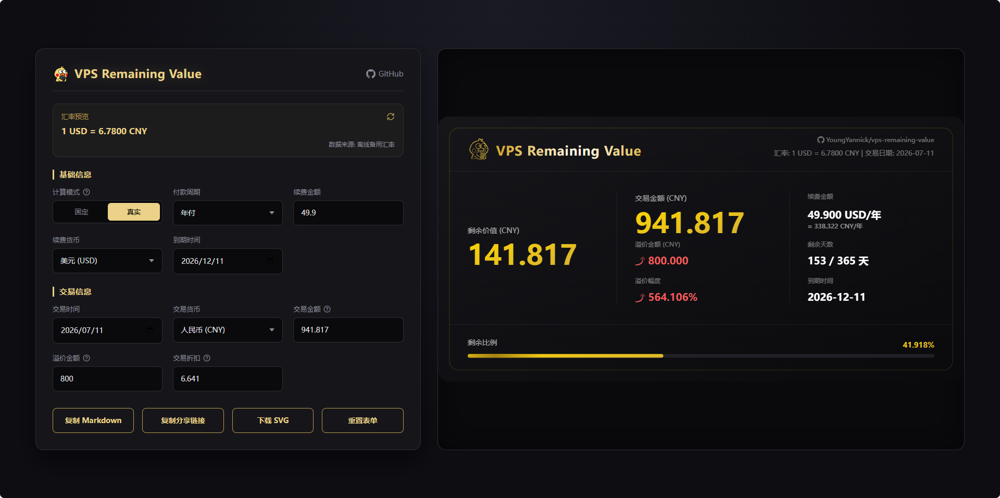

# VPS Remaining Value (VPS 剩余价值计算器)

一个用于计算各类订阅服务剩余价值的 Web 工具，支持动态汇率转换并可生成 SVG 分享图。



## SVG 预览

|  |  |
|-----------------------|-----------------------|

## 🚀 部署方式

### 方案 1: Cloudflare Pages（推荐）⭐

**优点**：
- ✅ 完全免费（每月 100,000 次请求）
- ✅ 全球 CDN 加速
- ✅ 自动 HTTPS
- ✅ 无需服务器维护
- ✅ 零成本运行

**快速部署**：
```bash
# 安装 Wrangler CLI
npm install -g wrangler

# 登录 Cloudflare
wrangler login

# 创建 KV 命名空间
wrangler kv namespace create "RATES_CACHE"
# 将返回的 id 填入 wrangler.toml

# 本地测试
npm run dev

# 部署到 Cloudflare Pages
npm run deploy
```

**详细步骤**：查看 [CLOUDFLARE_DEPLOY.md](./CLOUDFLARE_DEPLOY.md)

---

### 方案 2: 传统服务器部署

#### Node.js 直接运行

```bash
npm install
npm run start:express
```

服务默认运行在 http://localhost:45867

#### Docker 部署

```bash
docker build -t vps-remaining-value:latest .
docker run -d -p 45867:45867 \
  -e SECRET_KEY="YourCustomSecretKeyHere" \
  -e V6_API_KEY="YourExchangeRateV6KeyHere" \
  --restart always \
  --name vps-remaining-value \
  vps-remaining-value:latest
```

使用预构建镜像：
```bash
docker run -d -p 45867:45867 \
  -e SECRET_KEY="YourCustomSecretKeyHere" \
  -e V6_API_KEY="YourExchangeRateV6KeyHere" \
  --restart always \
  --name vps-remaining-value \
  ghcr.io/youngyannick/vps-remaining-value:latest
```

## 📁 项目结构

```
vps-remaining-value/
├── public/                 # 前端静态文件（可直接部署到 Cloudflare Pages）
│   ├── index.html         # 主页面
│   ├── css/               # 样式
│   ├── js/                # 前端逻辑
│   └── images/            # 图片资源
├── functions/              # Cloudflare Pages Functions（API 端点）
│   ├── api/
│   │   └── rates.js       # 汇率 API
│   ├── svg[[b64]].js      # SVG 生成
│   └── vrv[[b64]].js      # 短链接重定向
├── server.js              # Express 服务器（传统部署）
├── wrangler.toml          # Cloudflare 配置
└── CLOUDFLARE_DEPLOY.md   # Cloudflare 部署详细指南
```

## ✨ 功能特性

- 📊 实时计算 VPS/订阅服务剩余价值
- 💱 支持 15 种货币转换（USD, CNY, EUR, GBP 等）
- 📅 支持真实天数和固定天数计算模式
- 🎨 精美的 SVG 徽章生成
- 🔗 短链接分享
- 💾 智能汇率缓存（减少 API 调用）

## 🔧 环境变量配置

### Cloudflare Pages

在 Cloudflare Dashboard 设置：
- `V6_API_KEY`（可选）：ExchangeRate-API V6 的 API Key

### Express 服务器（.env）

```env
SECRET_KEY=your_secret_key_here
V6_API_KEY=your_v6_api_key_here
```

## 💰 成本对比

| 部署方式 | 月费用 | 性能 | 维护成本 |
|---------|--------|------|---------|
| **Cloudflare Pages** | **免费** | **极快（全球 CDN）** | **零维护** |
| Express + VPS | $3-10+ | 取决于服务器位置 | 需要维护服务器 |
| Docker | 取决于主机 | 取决于主机配置 | 中等维护成本 |

## 🛠️ 本地开发

```bash
# 克隆仓库
git clone https://github.com/GGBeng1/vps-remaining-value.git
cd vps-remaining-value

# 安装依赖
npm install

# Cloudflare Pages 本地开发
npm run dev

# Express 服务器本地开发
npm run start:express
```

## 📝 更新日志

### v0.2.0 (2024) - Cloudflare Pages 支持
- ✨ 新增 Cloudflare Pages Functions 支持
- 🚀 零成本部署方案
- 💾 KV 存储替代内存缓存
- 📝 完善的部署文档
- 🌍 全球 CDN 加速

### v0.1.2 - 初始版本
- 🎉 基于 Express 的完整功能
- 🔒 Cookie-based 身份验证
- 💱 多汇率源支持

## 🤝 贡献

欢迎提交 Issue 和 Pull Request！

## 📄 许可证

MIT License

## 🔗 相关链接

- [GitHub Repository](https://github.com/GGBeng1/vps-remaining-value)
- [Cloudflare Pages 部署指南](./CLOUDFLARE_DEPLOY.md)
- [问题反馈](https://github.com/GGBeng1/vps-remaining-value/issues)
